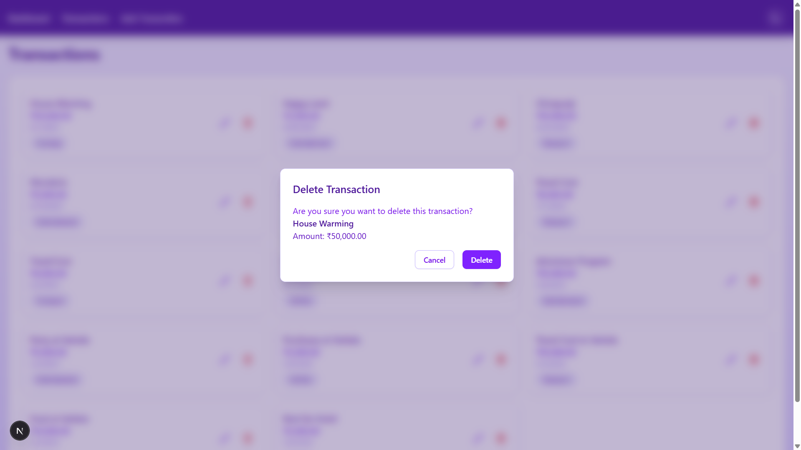

# FinSight - Personal Finance Tracker

FinSight is a modern, user-friendly personal finance tracking application built with Next.js 13, featuring a beautiful violet theme and intuitive interface for managing your transactions.

## 🚀 Stage 3 - Budget Management

### New Features Added

#### 1. Budget vs Actual Analysis
- 📊 Interactive chart comparing budgeted vs actual spending
- 📈 Visual indicators for over/under budget status
- 🔄 Real-time updates when transactions are added or modified
- 🎨 Color-coded bars for quick budget status assessment

#### 2. Budget Management
- 💰 Set monthly budgets for each category
- 📱 Easy budget adjustment with intuitive controls
- 🔔 Visual alerts for categories approaching budget limits
- 📈 Historical budget tracking and comparison

#### 3. Enhanced Dashboard Insights
- 📊 Budget utilization percentage for each category
- 📉 Spending trends vs budget over time
- 🎯 Progress indicators for budget goals
- 🔄 Real-time synchronization with transaction data

### Screenshots
### Budget Management
| Light Mode | Dark Mode |
|------------|------------|
|  |  |
| *Budget Management Interface* | *Budget Management Interface* |
|  |  |
| *Budget vs Actual Chart (Light Mode)* | *Budget vs Actual Chart (Dark Mode)* |

### Dashboard Overview
| Light Mode | Dark Mode |
|------------|------------|
|  |  |
| *Dashboard View 1 (Light/Dark Mode)* | *Dashboard View 1 (Dark Mode)* |
|  |  |
| *Dashboard View 2 (Light/Dark Mode)* | *Dashboard View 2 (Dark Mode)* |

---

## 🚀 Stage 2 - Categories & Dashboard

### New Features Added

#### 1. Category Management
- 🏷️ Predefined categories: Food, Transport, Housing, Entertainment, and Utilities
- 🎨 Color-coded categories for better visualization
- 🔄 Category assignment during transaction creation/editing

#### 2. Enhanced Dashboard
- 📊 Category-wise spending breakdown with interactive pie chart
- 📈 Monthly expense trends with bar chart
- 💰 Quick view of total monthly expenses
- 🌗 Beautifully designed dark and light mode support

#### 3. Improved Transaction Management
- 📱 Fully responsive transaction cards
- 🔄 Real-time updates across all views
- 🎨 Better visual hierarchy with category colors

### Screenshots

#### Dashboard Views
| Light Mode | Dark Mode |
|------------|------------|
|  |  |
|  |  |

#### Transactions & Add Transaction
| Light Mode | Dark Mode |
|------------|------------|
|  |  |
|  |  |

#### Transaction Modals
| Light Mode | Dark Mode |
|------------|------------|
| **Edit Transaction** | **Delete Confirmation** |
|  |  |
| **Edit Transaction (Dark)** | **Delete Confirmation (Dark)** |
|  |  |

---

## 📋 Stage 1 - Transaction Tracker (Completed)

### 🏠 FinSight Dashboard


### Features
- 📊 Interactive dashboard with monthly expense visualization
- 💸 Easy transaction management (Add, Edit, Delete)
- 💠 Modern glass-morphism UI design
- 🎨 Consistent violet theme throughout
- 🌗 Dark mode support
- ₹ Indian Rupee (INR) currency formatting
- 🚀 Real-time updates with optimistic UI
- 📱 Responsive design for all devices

## Tech Stack

- **Language**: [TypeScript](https://www.typescriptlang.org/)

- **Framework**: [Next.js 15](https://nextjs.org/) with App Router
- **Database**: [Prisma](https://www.prisma.io/) with PostgreSQL
- **Styling**: [Tailwind CSS](https://tailwindcss.com/)
- **Components**: 
  - [Shadcn/ui](https://ui.shadcn.com/) for base components
  - [Recharts](https://recharts.org/) for data visualization
  - [Headless UI](https://headlessui.com/) for accessible modals
  -[Lucide React](https://lucide.dev/) for icons

 -**Notifications**: [React-Toastify](https://fkhadra.github.io/react-toastify/)
- **State Management**: 
  - [Redux Toolkit](https://redux-toolkit.js.org/) for efficient state management
  - [React-Redux](https://react-redux.js.org/) for React integration
  - Features include:
    - Centralized application state
    - Immutable state updates with Immer
    - Redux DevTools integration for debugging
    - Optimized re-renders with memoized selectors
    - Async request handling with createAsyncThunk

## Getting Started

### Prerequisites

- Node.js 16.8 or later
- npm or yarn or pnpm

### Installation

1. Clone the repository:
   ```bash
   git clone https://github.com/Amal-A-K/FinSight.git
   cd finsight
   ```

2. Install dependencies:
   ```bash
   npm install
   # or
   yarn install
   # or
   pnpm install
   ```

3. Set up the database:
   ```bash
   npx prisma generate
   npx prisma migrate dev
   ```

4. Run the development server:
   ```bash
   npm run dev
   # or
   yarn dev
   # or
   pnpm dev
   ```

5. Open [http://localhost:3000](http://localhost:3000) with your browser to see the application.

## Project Structure

```
finsight/
├── src/
│   ├── app/                 # Next.js 13 app directory
│   │   ├── api/            # API routes
│   │   ├── page.tsx        # Dashboard page
│   │   └── ...            
│   ├── components/         # React components
│   │   └── ui/            # Reusable UI components
│   ├── lib/               # Utility functions
│   └── types/             # TypeScript types
├── prisma/                # Database schema and migrations
└── public/               # Static assets
```

## Key Features in Detail

### Transaction Management
- Add new transactions with amount, description, date, and category
- Edit existing transactions with real-time updates
- Delete transactions with confirmation modal
- Beautiful glass-morphism modals for all operations
- Card-based transaction display for better mobile experience
- State management using Redux and Redux Toolkit for efficient data flow

### Dashboard Visualization
- Monthly transaction summaries with category breakdown
- Interactive bar chart for expense trends
- Category-wise pie chart for visual spending analysis
- Formatted currency display with Indian Rupee (₹) support
- Responsive design for all screen sizes

### User Interface
- Consistent violet theme throughout with dark/light mode
- Smooth animations and transitions
- Accessible components following WCAG guidelines
- Toast notifications for all actions
- Responsive design that works on all devices
- Intuitive navigation with sticky header

## Contributing

Contributions are welcome! Please feel free to submit a Pull Request.

## License

This project is licensed under the MIT License - see the [LICENSE](LICENSE) file for details.

This project uses [`next/font`](https://nextjs.org/docs/app/building-your-application/optimizing/fonts) to automatically optimize and load [Geist](https://vercel.com/font), a new font family for Vercel.

## Learn More

To learn more about Next.js, take a look at the following resources:

- [Next.js Documentation](https://nextjs.org/docs) - learn about Next.js features and API.
- [Learn Next.js](https://nextjs.org/learn) - an interactive Next.js tutorial.

You can check out [the Next.js GitHub repository](https://github.com/vercel/next.js) - your feedback and contributions are welcome!

## Deploy on Vercel

The easiest way to deploy your Next.js app is to use the [Vercel Platform](https://vercel.com/new?utm_medium=default-template&filter=next.js&utm_source=create-next-app&utm_campaign=create-next-app-readme) from the creators of Next.js.

Check out our [Next.js deployment documentation](https://nextjs.org/docs/app/building-your-application/deploying) for more details.
